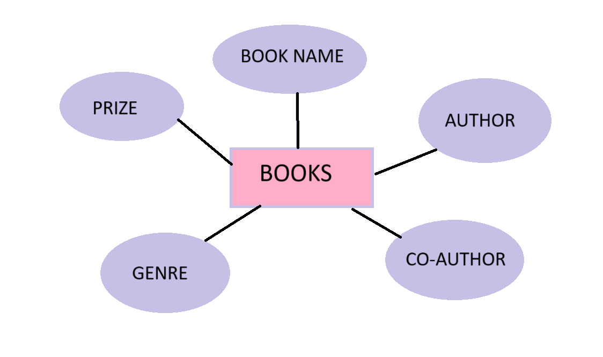

# Ex02 Django ORM Web Application
# Date:27.03.2024
# AIM
To develop a Django application to store and retrieve data from a bank loan database using Object Relational Mapping(ORM).

# ENTITY RELATIONSHIP DIAGRAM

## DESIGN STEPS
## STEP 1:
Clone the problem from GitHub

## STEP 2:
Create a new app in Django project

## STEP 3:
Enter the code for admin.py and models.py

## STEP 4:
Execute Django admin and create details for 10 books

# PROGRAM
models.py
``` 
from django.db import models
from django.contrib import admin
class Book(models.Model):
    name=models.CharField(max_length=30)
    author=models.CharField(max_length=50)
    coauthor=models.CharField(max_length=25)
    genre=models.CharField(max_length=100)
    price=models.IntegerField()
    
class BookAdmin(admin.ModelAdmin):
    list_display=('name','author','coauthor','genre','price')
```
admin.py
```
from django.contrib import admin
from .models import Book,BookAdmin
admin.site.register(Book,BookAdmin)
```

# OUTPUT


# RESULT
Thus the program for creating a database using ORM hass been executed successfully
